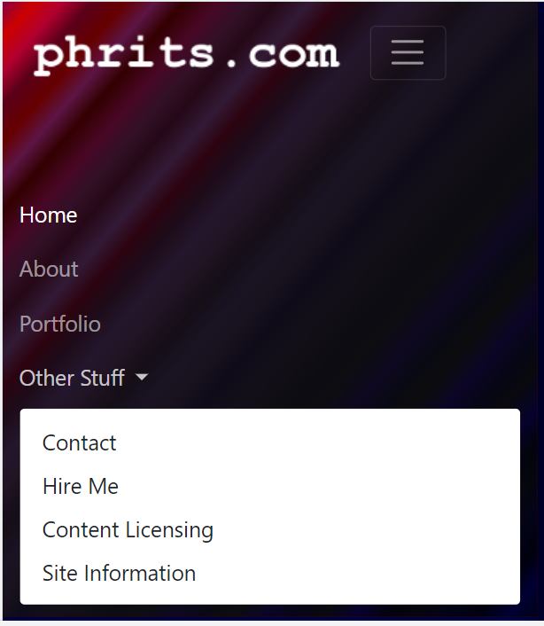
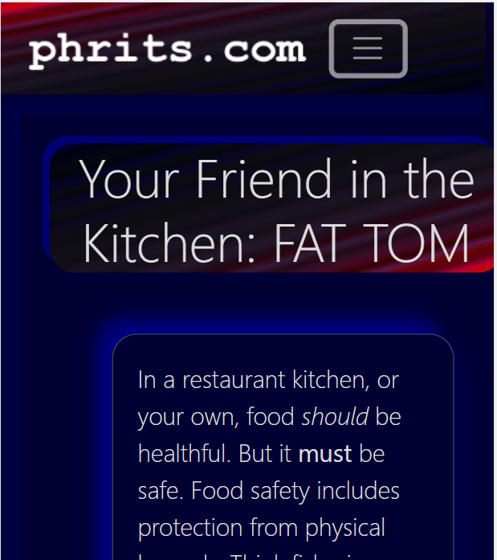
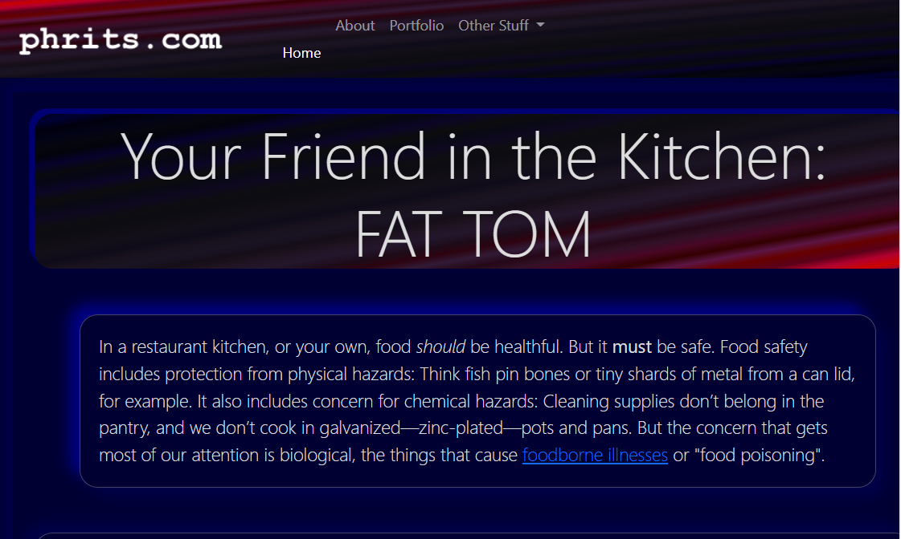

# WorkLog

## 2022-03-19

Screenshots of WIP.

- Pixel5 with the Menu open




- Pixel5 with the content visible



- Web Page in Chrome



- The ripple effect in the header backgrounds is from messing around with gradients.
```

background-image: linear-gradient(to right bottom, #00000d, #03030d, #06060e, #09090e, #0c0c0e, #0e0d12, #110e15, #150e17, #1d0b19, #250817, #2d0310, #330000);

background-image: linear-gradient(to right bottom, #00001a, #030318, #060616, #090914, #0c0c12, #120f19, #19121e, #201322, #331027, #480725, #5a0019, #660000);

background-image: linear-gradient(to right bottom, #000034, #07022d, #0c0526, #0e0820, #0f0b19, #191323, #24172d, #321a36, #5c1545, #890043, #b1002f, #cc0000);

/* Aggregated */

#00000d, #03030d, #06060e, #09090e, #0c0c0e, #0e0d12, #110e15, #150e17, #1d0b19, #250817, #2d0310, #330000, #00001a, #030318, #060616, #090914, #0c0c12, #120f19, #19121e, #201322, #331027, #480725, #5a0019, #660000, #000034, #07022d, #0c0526, #0e0820, #0f0b19, #191323, #24172d, #321a36, #5c1545, #890043, #b1002f, #cc0000

/* Sorted */
#00000d, #00001a, #000034, #03030d, #030318, #06060e, #060616, #07022d, #09090e, #090914, #0c0526, #0c0c0e, #0c0c12, #0e0820, #0e0d12, #0f0b19, #110e15, #120f19, #150e17, #19121e, #191323, #1d0b19, #201322, #24172d, #250817, #2d0310, #321a36, #330000, #331027, #480725, #5a0019, #5c1545, #660000, #890043, #b1002f, #cc0000

/* 3-line move top to bottom */
#00001a, #000034, #00000d, #030318, #06060e, #03030d, #07022d, #09090e, #060616, #0c0526, #0c0c0e, #090914, #0e0820, #0e0d12, #0c0c12, #110e15, #120f19, #0f0b19, #19121e, #191323, #150e17, #201322, #24172d, #1d0b19, #2d0310, #321a36, #250817, #331027, #480725, #330000, #5c1545, #660000, #5a0019, #b1002f, #cc0000, #890043

/* 3-line move top to bottom reversed */
#890043, #cc0000, #b1002f, #5a0019, #660000, #5c1545, #330000, #480725, #331027, #250817, #321a36, #2d0310, #1d0b19, #24172d, #201322, #150e17, #191323, #19121e, #0f0b19, #120f19, #110e15, #0c0c12, #0e0d12, #0e0820, #090914, #0c0c0e, #0c0526, #060616, #09090e, #07022d, #03030d, #06060e, #030318, #00000d, #000034, #00001a
```

## 2022-03-18/19


It's ugly, but it's a start.

## 2022-03-17/18

Finally got the last Archive Disclaimer banner working. Geez, I had hard calls to the old init.php for days!

Got git set up with cPanel. Lots easier with a public repo. Above board indeed.

Decided against worrying about getting virtualenv set up on the linux side of things, at least for now. Deleted what I could find of that and other remnants including the django folder, virtualenv folder. I'll end up reinstalling fresh if I need it later anyway, so the remaining bin files sticking around aren't hurting anything.

Added a LICENSE to the repo. CC 1.0 Universal, or something similar.

I had yet another hard drive crash, and the usual flailing about with Dropbox fucked up my installed programs. Thus:

### Fresh

- Python (3.10.10)

- Anaconda (4.10.3. Giant installation.)

- PostgreSQL

- pgAdmin

- Flask

- Django

- Jupyter

- pandas

- SQLAlchemy

See [`2022-03-18.requirements.txt`](2022-03-18.requirements.txt) for specifics.

### Not Updated

#### VS Code
```
Version: 1.65.2 (user setup)
Commit: c722ca6c7eed3d7987c0d5c3df5c45f6b15e77d1
Date: 2022-03-10T14:33:55.248Z
Electron: 13.5.2
Chromium: 91.0.4472.164
Node.js: 14.16.0
V8: 9.1.269.39-electron.0
OS: Windows_NT x64 10.0.22000
```

- gitbash (2.34.1.windows.1)

## 2022-03-05

Repo setup. `$www . "/content/parts/part_splash.php"` reflecting same.

### Visual Notes

#### Comfortable Colors

[Source](https://www.nexcess.net/blog/web-design-trends/)

Consider for the palate making the main, the dark blue brigher by 20% or so. Highlight yellow gets muted or morphed appropriately.

##### Potential blue: #0000AA

[Neumorphism.io](https://neumorphism.io/#0000AA)

```
border-radius: 32px;
background: linear-gradient(145deg, #0000fa, #0000d3);
box-shadow:  16px 16px 32px #000075,
             -16px -16px 32px #0000ff;
```

##### Maroon: #663333

[neumorphic.design](https://neumorphic.design/)

```
background: linear-gradient(145deg, #783C3C, #542A2A);
border-radius: 15%;
box-shadow: 7.21px 7.21px 9px #3F1F1F, -7.21px -7.21px 9px #8D4747;
```
Consider dark mode backgrounds to make stuff jump when it should.

#### Neumorphism

Looks self-codable, but there appear to be some free wheels out there already. Generators such as [Neumorphism.io](https://neumorphic.design/) include concavity and inset for input parameters, then produce borders and shadows. Examples:

```
background: linear-gradient(145deg, #6677DB, #465397);
border-radius: 36%;
box-shadow: 7.21px 7.21px 9px #353E72, -7.21px -7.21px 9px #778CFF;
```

```
border-radius: 50px;
background: linear-gradient(145deg, #0000f5, #0000ce);
box-shadow:  25px 25px 35px #000073,
             -25px -25px 35px #0000ff;
```


Pictures. Graphics.